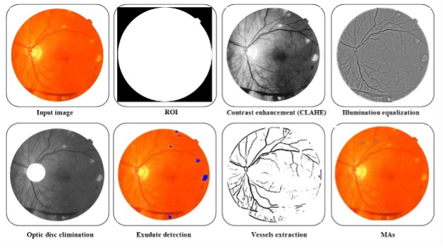

# An Unsupervised Framework for Exudate and Microaneurysm Detection

This repository contains the official C++ source code for the paper: **"Designing an Adaptive Color Morphology Operator for Exudates and Microaneurysms Detection in Color Fundus Images"**.

**Authors:** Milad Rostamian and Motahare Shekari



---

## Abstract

Diabetic retinopathy (DR) is a leading cause of preventable blindness. This paper introduces a novel, fully unsupervised framework that integrates the detection of exudates (EXs) and microaneurysms (MAs). The core of our method is a new Adaptive Color Morphology (ACM) operator that leverages the CIE L*a*b* color space for robust exudate segmentation. This segmentation map is then used to refine the search space for MA detection, reducing inter-lesion confusion.

---

## Installation

This project is implemented in C++ and depends on the OpenCV library.

1.  **Clone the repository:**
    ```bash
    git clone [https://github.com/milad67/Adaptive-Color-Morphology-DR.git](https://github.com/milad67/Adaptive-Color-Morphology-DR.git)
    cd Adaptive-Color-Morphology-DR
    ```

2.  **Dependencies:**
    * C++ Compiler (g++)
    * CMake (version 3.10+)
    * OpenCV (version 3.x)

3.  **Build:**
    ```bash
    mkdir build
    cd build
    cmake ..
    make
    ```

---

## Usage

To run the detection on a sample image, use the following command from the `build` directory:

```bash
./detect_lesions ../data/sample_image.jpg
```
The output segmentation maps will be saved in the `/results` directory.

---

## Datasets

The public datasets used in this study can be downloaded from their official sources:
* **e-Ophtha:** `http://www.adcis.net/en/Download-Third-Party/E-Ophtha.html`
* **ROC Database:** `https://roc.healthcare.uiowa.edu/`
* **DDB1 Database:** [Link to dataset]

---

## Citation

If you find this work useful in your research, please consider citing our paper. *(Remember to update this with your final publication details)*

```bibtex
@article{Rostamian2025,
  title   = {Designing an Adaptive Color Morphology Operator for Exudates and Microaneurysms Detection in Color Fundus Images},
  author  = {Rostamian, Milad and Shekari, Motahare},
  journal = {Journal Name},
  volume  = {XX},
  number  = {Y},
  pages   = {ZZZ--ZZZ},
  year    = {2025}
}
```
